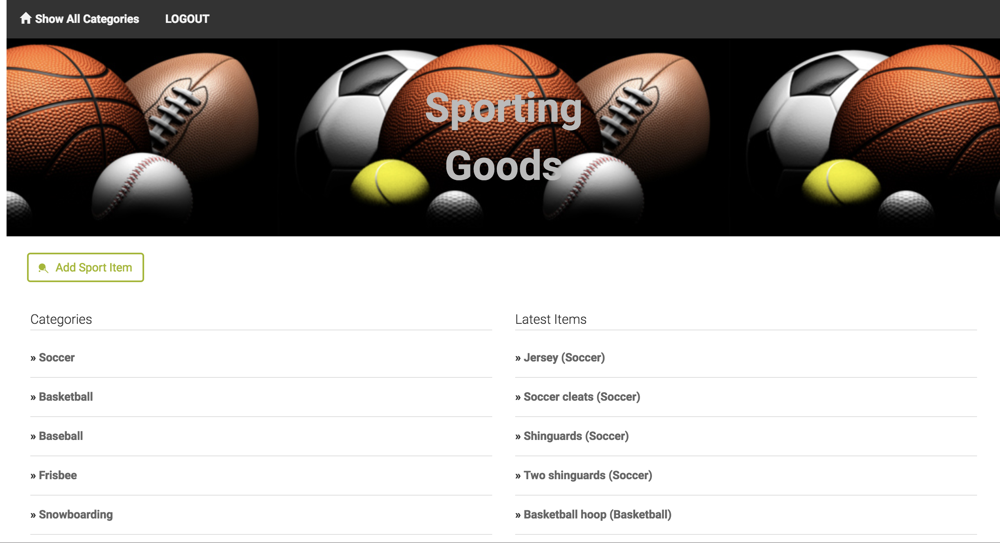

# Sporting Goods Web Application



The Sporting goods app is a web application which displays sporting gears for various sports.
The user can login using his/her google account, once logged in, the user can add, delete or modify the items for respective sport. Only the owner of each item is authorised to modify or delete his/her item. All other users are permitted to view all the available items on the portal.

## Prerequisites
* Install VirtualBOx
VirtualBox is the software that actually runs the VM. [You can download it from virtualbox.org, here.](https://www.virtualbox.org/wiki/Download_Old_Builds_5_1)Install the platform package for your operating system. You do not need the extension pack or the SDK. You do not need to launch VirtualBox after installing it.
* Install Vagrant
Vagrant is the software that configures the VM and lets you share files between your host computer and the VM's filesystem. [You can download it from vagrantup.com.](https://www.vagrantup.com/downloads.html) Install the version for your operating system.
* Once the VirtualBox and vagtrant is set up, From the command line, navigate to the folder containing the Vagrantfile
* Power up the virtual machine by typing: vagrant up note: this may take a couple minutes to complete
* Once the virtual machine is done booting, log into it by typing: vagrant ssh
* Execute the following commands to insert the Sample data into the database:
```
python catalog_database_setup.py
```
```
python insert_catalog_items.py
```


## Deployment
After all the prerequisites are done, execute the below command, to start the web application
```
python application.py
```
The user can access the links to the application using the following URLs:
* http://localhost:5000/catalog (Displays all the available items)
* Selecting each category will display items for the respective category on the right hand side of the page.
* Selecting each item will open the item description page, which displays the item description and you can edit/delete the respective item if you are the owner of the item.
* Following are the links for JSON endpoints which the application provides:
  * http://localhost:5000/catalog/JSON (Lists all the catagories)
  * http://localhost:5000/catalog/1/item/JSON (Lists items for Category ID "1")
  * http://localhost:5000/catalog/1/item/1/JSON (Lists the item for Item ID "1" under Catgory ID "1")


## Authors
* **Divya Tuduma**